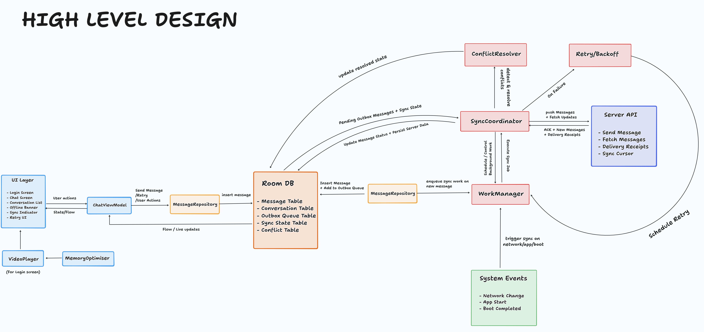
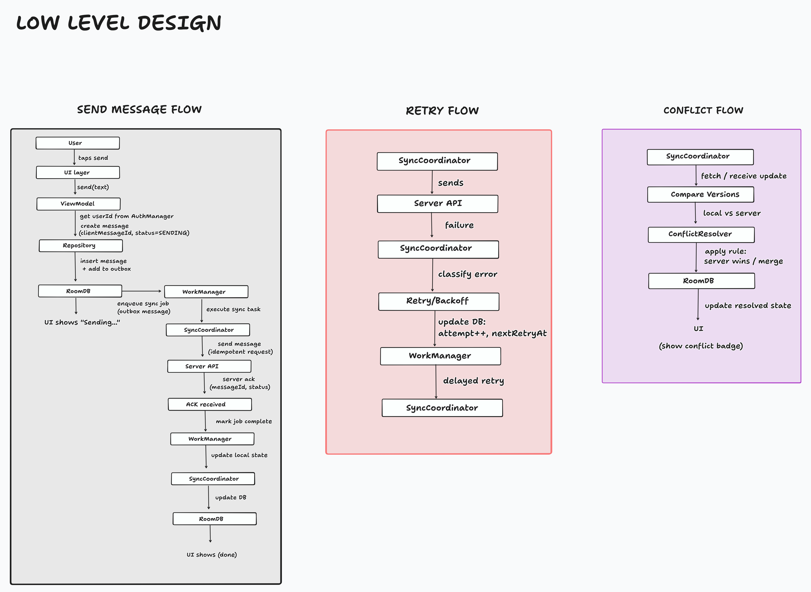

# Intelligent Messaging App (Offline-First)

A production-grade, offline-first messaging application built with modern Android development practices. This app ensures message reliability, robust background synchronization, and conflict resolution while maintaining a highly optimized UI within strict memory constraints.

## Key Features

- **Offline-First Architecture**: Messages are persisted immediately to a local Single Source of Truth (Room DB) before network transmission.
- **Reliable Background Sync**: Leveraging WorkManager to ensure messages are delivered even if the app is force-killed or the device reboots.
- **Conflict Resolution**: Advanced handling of data divergence using versioning and manual user resolution flows.
- **Optimized Video Login**: Immediate, zero-delay background video playback on the login screen with `< 100MB` RAM footprint.
- **Premium UX**: Includes shimmering skeleton loaders, real-time connectivity banners, and per-message delivery status (⏳, ✓, ✓✓).
- **Memory Efficient**: Chat screen optimized for `< 200MB` RAM usage using `LazyColumn` key/type optimizations.

---

## Architecture & Design

The project follows **Clean Architecture** principles combined with the **Repository Pattern** and **MVVM**.

### High-Level Design (HLD)
The HLD illustrates the global data flow between the UI, the Local Outbox, and the Sync Engine.



### Low-Level Design (LLD)
The LLD focuses on the specific implementation of the Sync Worker and the Conflict Resolution logic.



> For a deep dive into the implementation details, phases, and edge case handling, see [implementation_details.md](docs/implementation_details.md).

---

## Tech Stack

- **UI**: Jetpack Compose (Modern Declarative UI)
- **Language**: Kotlin
- **Dependency Injection**: Hilt (Dagger)
- **Database**: Room (Offline Persistence)
- **Background Work**: WorkManager (Reliable Sync)
- **Media**: ExoPlayer/Media3 (Efficient Video Playback)
- **Networking**: Retrofit & Kotlinx Serialization
- **Architecture**: MVVM + Clean Architecture
- **Testing**: MockK + JUnit 4 + Coroutines-Test

---

## Testing

The app includes unit tests for core business logic, including message sending and conflict resolution.

To run the tests and see detailed results in your terminal:
```bash
./gradlew :app:testDebugUnitTest --rerun-tasks
```

The terminal will output pass/fail status for individual test cases like:
- `sendMessage should insert message and outbox entry PASSED`
- `resolveConflict with useLocal true should retry message PASSED`

---

## Performance Metrics

| Screen | Target RAM Usage | Achievement |
| --- | --- | --- |
| **Login Screen** | ≤ 100 MB | Optimized via Media3 SurfaceView |
| **Chat Screen** | ≤ 200 MB | Optimized via LazyColumn reuse |

---

## License

This project is developed for demonstration of production-grade Android engineering principles.
